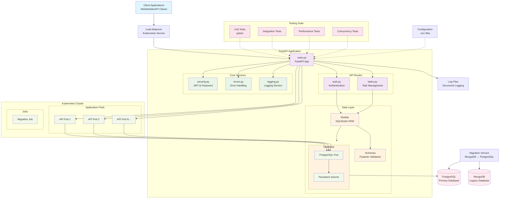

# Task Management API - Architecture Diagram

## Architecture Components

### 1. **Client Layer**
- Web applications, mobile apps, or direct API clients
- Communicates via HTTP/HTTPS with JWT authentication

### 2. **API Gateway & Load Balancing**
- Kubernetes Service for load balancing
- Routes traffic to multiple application pods
- SSL termination and request routing

### 3. **FastAPI Application Core**
- **main.py**: Application entry point with middleware and routing
- **Authentication API**: User registration, login, JWT token management
- **Task API**: CRUD operations for task management
- **Security Layer**: JWT validation, password hashing, user authentication
- **Error Handling**: Centralized exception handling and logging
- **Logging Service**: Structured logging with file rotation

### 4. **Data Layer**
- **SQLModel Models**: ORM models for User and Task entities
- **Pydantic Schemas**: Request/response validation and serialization
- **Database Connection**: PostgreSQL connection pool with health checks
- **Relationships**: User ↔ Task one-to-many relationship

### 5. **Database Layer**
- **PostgreSQL**: Primary relational database
- **Connection Pooling**: Optimized connection management
- **Constraints**: Unique constraints and foreign key relationships

### 6. **Migration Service**
- Standalone service for migrating data from MongoDB to PostgreSQL
- Batch processing with progress tracking
- Containerized for Kubernetes deployment

### 7. **Kubernetes Infrastructure**
- **Application Pods**: Horizontally scalable FastAPI instances
- **Database Pod**: PostgreSQL with persistent storage
- **Persistent Volume**: Data persistence across pod restarts
- **Migration Job**: One-time data migration execution

### 8. **Testing Suite**
- **Unit Tests**: Individual component testing
- **Integration Tests**: End-to-end API testing
- **Performance Tests**: Load and stress testing
- **Concurrency Tests**: Multi-user scenario testing

### 9. **Configuration & Monitoring**
- Environment-based configuration (.env files)
- Structured logging with rotation
- Health check endpoints
- Database connection monitoring

## Key Features

- **Authentication**: JWT-based with token blacklisting
- **Authorization**: User-specific task access control
- **Data Validation**: Pydantic schemas for request/response validation
- **Error Handling**: Comprehensive exception handling with logging
- **Database**: PostgreSQL with connection pooling and health checks
- **Scalability**: Kubernetes-ready with horizontal pod scaling
- **Testing**: Comprehensive test suite with multiple test types
- **Migration**: MongoDB to PostgreSQL data migration support
- **Monitoring**: Health checks and structured logging

## Security Features

- Password hashing with bcrypt
- JWT token authentication
- Token blacklisting for logout
- User-specific data access control
- Input validation and sanitization
- SQL injection prevention via ORM

## Deployment Architecture

The application is designed for cloud-native deployment with:
- Container orchestration via Kubernetes
- Horizontal scaling capabilities
- Persistent data storage
- Health monitoring and logging
- Environment-based configuration management